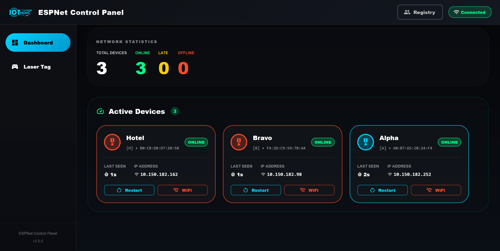
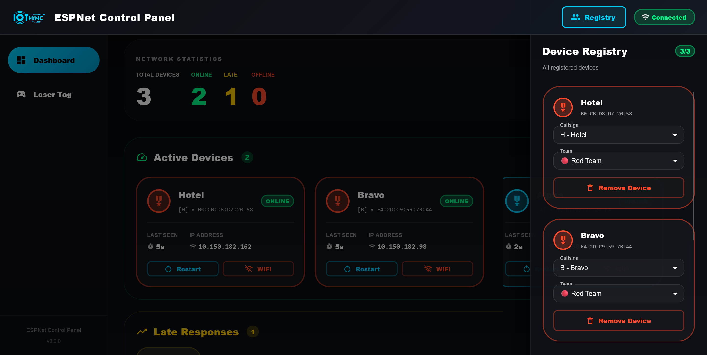
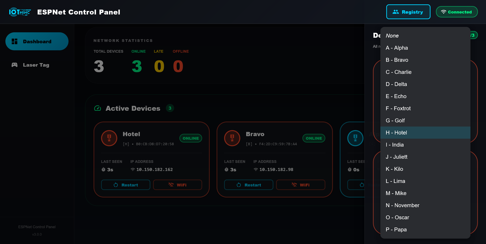
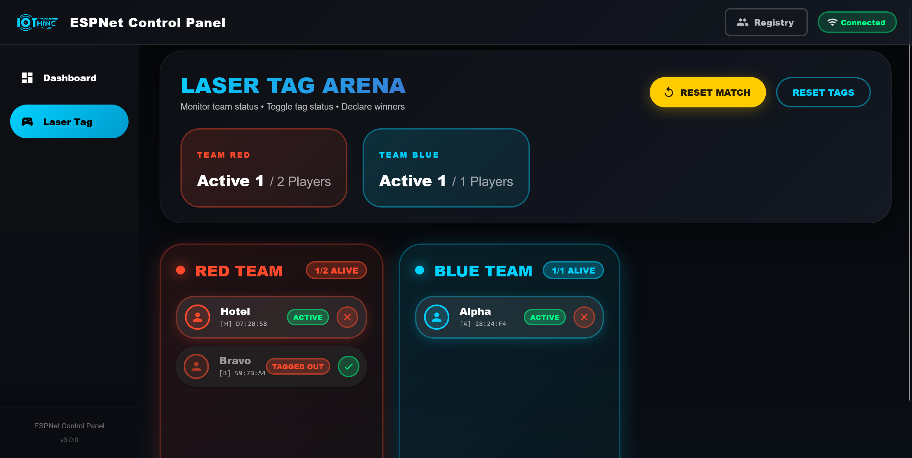

# ESPNet Server Frontend

React-based control panel for managing ESP32 laser tag devices over UDP networking.






## What is this?

Frontend dashboard for the ESPNet laser tag system. Connects to a Rust backend (running on port 8080) via WebSocket and provides real-time device management, game controls, and team-based laser tag gameplay.

## Features

- **Real-time device monitoring** - WebSocket connection shows live device status
- **Device registry** - Assign NATO callsigns and team colors to ESP32 nodes
- **Laser tag game mode** - Red vs Blue team gameplay with manual tagging
- **Dashboard view** - Monitor all connected devices, restart them, or reset WiFi
- **Responsive UI** - Dark theme with Material-UI components

## Tech Stack

- React
- Material-UI (MUI)
- WebSocket for real-time updates
- REST API for device control

## Setup

### Prerequisites

- Node.js and npm
- ESPNet Rust server running on port 8080

### Installation

Clone the repo and install dependencies:

```bash
npm install
```

### Running

Start the development server:

```bash
npm start
```

The app will open at `http://localhost:3000/`

Make sure the Rust backend is running on `http://localhost:8080` before starting the frontend.

## Project Structure

```
src/
├── App.js           # Main app with routing and WebSocket
├── Dashboard.jsx    # Device management view
├── LaserTag.jsx     # Game controls and scoreboard
└── index.js         # Entry point
```

## Configuration

If you need to change the backend server address, edit these lines in `App.js`:

```javascript
const wsUrl = `ws://localhost:8080/ws`;  // WebSocket connection
const response = await fetch(`http://localhost:8080${endpoint}`);  // API calls
```

## Features Breakdown

### Device Registry
- View all registered ESP32 devices (online and offline)
- Assign NATO phonetic callsigns (Alpha, Bravo, Charlie, etc.)
- Set team colors (Red/Blue)
- Remove devices from registry

### Dashboard
- Real-time device status monitoring
- Restart individual devices remotely
- WiFi reset for reconfiguration
- Connection uptime tracking

### Laser Tag Mode
- Team-based view (Red vs Blue)
- Manual status toggle for each device
- Victory when all opponents tagged
- Reset game and tag states
